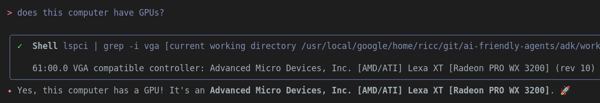

This folder contains a few workshops, but let me explain:

1. 📁 `complex-travel-agent/`. This was a moonshot "hold my beer" kind of thing. I vibecoded in an afternoon what Ive been meaning to code manually for the past 6 months, since ADK came out. See README for a nice outline of this project. Note **EVERYONE** is doing Travel agents on the web! So don't sweat too much on the coding or arhitectural aspect. Just spend a few minutes on the `GEMINI.md` and the `THE_APP.md` parts.
2. 📁 `simple-travel-agent/`. This is an extract from the above to become a L100 ADK + Gemini CLI workshop. In a way, **this is the REAL workshop**.
   1. In case this breaks, I tested 4 steps solutions with this tag: [workshop-simple-travel-agent-v0.2](https://github.com/palladius/ai-friendly-agents/tree/workshop-simple-travel-agent-v0.2).

Note: this readme was surprisingly written manually by Riccardo. No GPU was used to write this..

.. Sorry, I lied.
