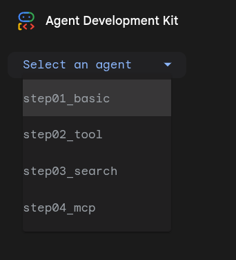

# Workshop: Building a Simple Travel Agent

Welcome to the ADK workshop! In this session, we will build a simple travel agent step-by-step.

*Curiosity*: This workshop was built by Riccardo Carlesso with help from Gemini CLI. If you're curious, you can find how i did it by
looking at the `GEMINI.md` and `WORKSHOP_PLAN.md` in this folder.



**Solutions**. Note: the code is all contained under `steps/`. If you don't want to cheat, you can just read there. For the purpose of this
Lab, this is ok. We're not here to learn how to write good ADK code, but how to set up yuour environment to get GOOD code automatically written
under your direction. (1) Installing the software, (2) configuring / getting it to work, and (3) entering the Golden Feedback Loop is what we
really want you to learn here. You can also test them all at the same time via `just web-4steps`!


## Prerequisites (Installation)

For this tutorial, you need to install:
1. `python` and `uv` (best package manager for Python). Ensure you have `uv` installed:

```bash
curl -LsSf https://astral.sh/uv/install.sh | sh
```

2. **[Gemini CLI](https://github.com/google-gemini/gemini-cli)**. For gemini CLI, find installation instructions here: https://github.com/google-gemini/gemini-cli .
   1. Note this requires having `npm` or `npx` installed.
   2. On Mac, you can use `brew` as per
   3. On Windows, you can use `chocolatey` or just download the executable from https://nodejs.org/en/download

3. [optional] Install Casey's [just](https://github.com/casey/just), it's a 21st century `Makefile` if you like makefiles.

## Step 0: set up your work environment

```bash
$ mkdir -p mysolution/
$ touch mysolution/__init__.py mysolution/agent.py
```

## Step 1: Basic Agent


Let's start by creating a basic agent that can have a conversation.

Create a file named `mysolution/__init__.py`:

```python
from .agent import root_agent
```

As simple as that! This allows ADK to know where your code is: in `agent.py`.

Create a file named `mysolution/agent.py`:

```python
from google.adk.agents import Agent

root_agent = Agent(
    name="travel_basic",
    model="gemini-2.5-flash",
    instruction="You are a helpful travel assistant." +
    "You can help with general travel advice based on your knowledge.",
)
```

### Testing the agent

This is true for all the steps. ADK allows you to test your agent in two ways: CLI and Web.
* **CLI** is best for quick and automated tests
* **Web** is the best to visually see what's happening, use microphone (!), and troubleshooting.

**Tip**: for the purpose of this exercise, for everything except unit testing, use the Web. It's really amazing!

A good prompt which properly tests steps 1-2-3-4 can be this:

```markdown
## Smart "litmus prompt"

Hi, I'd like to book a hotel in Paris for tomorrow evening alone, one night, in Paris city center.
Ideally close to Gare de Lyon. Budget: below 200eur per night.

1. Tell me which YYYYMMDD and Day of the Week is tomorrow.
2. Tell me which hotel do you see for tomorrow (at least 3). I want to see: price, address, some rating (from Google
   Hotels, Booking or Airbnb). Give me them in TABULAR format. Ideally, hotel name should be linked to some sort of URL
   of the hotel. Ensure the link is legit (it works and page points to info about the hotel!)

```

This is a smart prompt as it tests time and hotels and will fail differently in steps 1,2,3 and should fully succeed only in step 4.
You can of course use any prompt you want!


Run it from bash (CLI):
```bash
uv run mysolution/agent.py
```


Try asking it the "litmus prompt" above.


It will likely **fail** to know specific dates. We need to teach it to know the date!

For web, you can do this:

1. `uv run  adk web .` : This runs all agents under this folder. You want to point it to  "mysolution/" subfolder
2. choose `mysolution/` on top right . See image below
3. Ask your question in text or via microphone something along the lines of the "litmus prompt".


Note you need to call `adk web` from the upper folder, respect to the CLI version.

Here's a possible solution, with a date semi-hallucination. Note 3 of the 5 booking links are working! Not bad.

<!--

-->

## Step 2: Add the `now()` tool

The agent doesn't know what "today" is. Let's give it a tool.

Add this function to `agent.py`:

```python
from datetime import datetime

def now() -> dict:
    """Returns the current date and time."""
    return {"current_time": datetime.now().strftime("%Y-%m-%d %H:%M:%S")}
```


Update the agent definition to include the tool:

```python
    travel_agent = LlmAgent(
        name="..",
        model="..",
        instruction="..",
        # This is the only line you want to add.
        tools=[now]
    )
```

Run it again and ask the same question. It should now know the date (good), and be vague about hotels (bad)!


## Step 3: Let's use a built-in Tool: `google_search`


Now that we know how to create a custom tool, let's explore how to use one of the powerful built-in tools provided by ADK: `google_search`. This allows our agent to access real-time information from the web.


```python
from google.adk.tools import google_search
```

**Note**: 🚨 `gemini-2.5-flash` cannot mix Google Search with custom tools (see [Issue #969](https://github.com/google/adk-python/issues/969) or [docs/ISSUES.md](./docs/ISSUES.md)), so we will **replace** `now()` with `google_search`.

### Your Goal

Your task is to modify the agent from Step 2. Instead of using the `now` tool, you will import and use the `google_search` tool from the ADK library.

**Full Code:** `steps/step03_search/agent.py`

```python
# Remember to REMOVE the now() tool here. See above why.
from google.adk.agents import Agent
from google.adk.tools import google_search

root_agent = Agent(
    model="gemini-2.5-flash",
    tools=[google_search],
    instruction="""You are a travel agent.
Your job is to help the user plan a trip.
You have access to a search engine.
If you don't know the answer, you can use the search engine.
When you are done, reply with "DONE".""",
)
```

### How to Run

To see your search-enabled agent in action, you need to run your own code!

1.  **Restart the Agent**: If you are running the Web UI, stop it (CTRL-C) and restart it.
2.  **Run**:
    ```bash
    just web-mysolution
    ```
    (Or `just run-mysolution` for CLI).
3.  **Select**: Choose `mysolution` in the Web UI.

Try asking it a question that requires current information, like "What's the weather like in London?" or "What are some tourist attractions in Paris?".

**Experts only**. For a more advanced integration (using `google_search` and `now` together), check the code in `steps/step03b_search_and_tool/agent.py` and run it with `just run-step3b`.

## Step 4: A more sophisticated Tool: MCP


Now that we've seen both custom and built-in tools, let's graduate to something more powerful: the **Model-as-a-Tool** pattern using the **Model Context Protocol (MCP)**.

To keep this step focused on the powerful capabilities of MCP, we will once again **replace** our previous tool (`google_search`). We will reintroduce our simple `now` tool to run alongside the `airbnb_mcp` tool. This demonstrates how an agent can use multiple, compatible tools (in this case, a `FunctionTool` and an `MCPToolset`) to perform complex tasks.

**Code:** `steps/step04_mcp/agent.py`

```python
# ... Imports as before
from google.adk.tools.mcp_tool.mcp_toolset import MCPToolset
from google.adk.tools.mcp_tool.mcp_session_manager import StdioConnectionParams
from mcp import StdioServerParameters

def now() -> dict:
    # ... as before

# Configure the Airbnb MCP Toolset
airbnb_mcp = MCPToolset(
    connection_params=StdioConnectionParams(
        server_params=StdioServerParameters(
            command='npx',
            args=["-y", "@openbnb/mcp-server-airbnb"],
        ),
    )
)

root_agent = Agent(
    name="travel_mcp",
    model="gemini-2.5-flash",
    instruction="You are a helpful travel assistant. You can find accommodation using Airbnb, and have access to the current time.",
    tools=[now, airbnb_mcp],
)
```

### How to Run

This step requires `npx` to be installed on your system.

1.  **Restart**: Stop and restart your agent.
2.  **Run**:
    ```bash
    just web-mysolution
    ```
3.  **Test**: Ask the agent to find you a place to stay, for example: "*Find me a 2-bedroom apartment in Rome for next Saturday.*"

## Milestone 1 Complete!

Congratulations! **You are now an ADK expert!** You've completed the workshop and have successfully built and tested AI agents with custom tools, built-in tools, and advanced MCP tools. You are now ready to build your own amazing agents with the Google Agent Development Kit!


You now have a functional travel agent that knows the time and can search the web. The sky is now the limit!

Please take a moment to vibecode an additional functionality with "Gemini CLI".

## Milestone 2: vibe coding your way through ADK via Gemini CLI

Now we enter the interesting part of the workshop.

1. ensure you have `git commit`ted the code somewhere safe. You can fork the original code, or create a branch: dont worry, Gemini CLI is great at helping you here!
2. Find an **idea** to implement. You can check the ideas below, find one yourself, or ask Gemini to look at documentation in rag/ and propose a few smart ideas.
3. Follow the prerequisites to ensure Gemini *can read* ADK docs, and then you're good to go!

### Ideas

Some Ideas of different complexity.

 1. 🟢 [easy] Not a python developer? You prefer `go` or `java`? Refactoring the existing code is very simple! Just make sure to download the proper ADK and ask Gemini CLI to do the translation!
 1. 🟢 [easy] Add emojis or specify some output format you like (eg, a table with hotel emoji, followed by price, followed by 1-5 star emojis based with 🌕🌕🌕🌗🌑 to do halves too!).
 1. 🟢 [easy] Change the prompt to teach it things you're specifically looking for or against (pet-friendly, no ground floor, silent, close to public transport, ..) and test it. Maybe add a personal rating like "a YOUR_NAME-rating from 1-10" based on the above, and sort by that rating.
 1. 🟢 [easy] Any Operator in the room? Deploy to [Cloud Run](https://cloud.google.com/run)! Or to [Agent Engine](https://google.github.io/adk-docs/deploy/agent-engine/)!
 1. 🟡 [medium] Create a subagent who does the `HotelSearch` and create a `BudgetAgent` or a `LocationAgent` which can double down and iterate over hotels respecting your location needs, eg "not more than X km from LOCATION". If the API doesn't allow this, it might be some back and forth helped by GoogleSearch. Note: Gemini cLI can help you.
 1. 🟡 [medium] Integrate with [A2A](https://github.com/a2aproject/A2A). Make it an A2A agent! Again, ask Gemini CLI for help!
 1. 🔴 [complex] You can integrate with Flights or other MCP functionality to create a multi-faceted multi functional travel agent.

Looking for further inspiration?
1. Check in Maurizio's [great ADK tutorial](https://mauripsale.github.io/doc-adk-training/) for some ideas.
2. Ask Gemini CLI to find ideas by looking at documentation under `rag/`.

## Prerequisites


To vibe code a functionality, we recommend that you download the whole ADK [python ADK](https://github.com/google/adk-python) (note: this can be adapted very easily to your favorite language, like [Java](https://github.com/google/adk-java) or [Go](https://github.com/google/adk-go)!)

Code is under `./download-adk.sh`.

Ensure your `gemini/settings.json` contains the following:

```json
{ "fileFiltering": {
    "respectGitIgnore": false
}}
```

**Why?** We want Gemini to be able to read those files, while they're safely git-ignored. This does the trick (but potentially opens a lot of `node_modules/` and `__pycache__/` garbage - so use with caution!)
