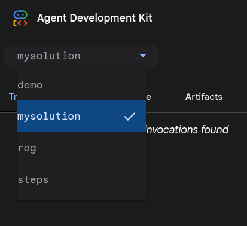
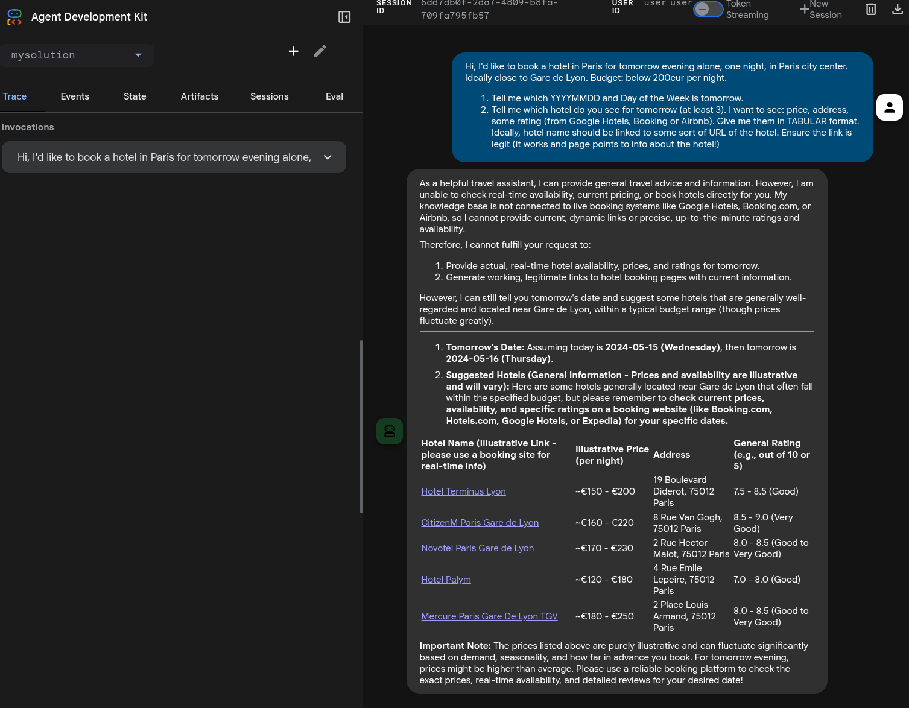

# Workshop: Building a Simple Travel Agent

Welcome to the ADK workshop! In this session, we will build a simple travel agent step-by-step.

*Curiosity*: This workshop was built by Riccardo Carlesso with help from Gemini CLI. If you're curious, you can find how i did it by
looking at the `GEMINI.md` and `WORKSHOP_PLAN.md` in this folder.

**Solutions**. Note: the code is all contained under `steps/`. If you don't want to cheat, you can just read there. For the purpose of this
Lab, this is ok. We're not here to learn how to write good ADK code, but how to set up yuour environment to get GOOD code automatically written
under your direction. (1) Installing the software, (2) configuring / getting it to work, and (3) entering the Golden Feedback Loop is what we
really want you to learn here.

## Prerequisites (Installation)

For this tutorial, you need to install:
1. `python` and `uv` (best package manager for Python). Ensure you have `uv` installed:

```bash
curl -LsSf https://astral.sh/uv/install.sh | sh
```

2. **[Gemini CLI](https://github.com/google-gemini/gemini-cli)**. For gemini CLI, find installation instructions here: https://github.com/google-gemini/gemini-cli .
   1. Note this requires having `npm` or `npx` installed.
   2. On Mac, you can use `brew`
   3. On Windows, you can use `chocolatey` or just download the executable from https://nodejs.org/en/download


## Step 0: set up your work environment

```bash
$ mkdir -p mysolution/
$ touch mysolution/__init__.py mysolution/agent.py
```

## Step 1: Basic Agent


Let's start by creating a basic agent that can have a conversation.

Create a file named `mysolution/__init__.py`:

```python
from .agent import root_agent
```

As simple as that! This allows ADK to know where your code is: in `agent.py`.

Create a file named `mysolution/agent.py`:

```python
"""This is the solution_1 agent code for the simple travel agent workshop."""

from google.adk.agents import Agent

root_agent = Agent(
    name="travel_basic",
    model="gemini-2.5-flash",
    instruction="You are a helpful travel assistant. You can help with general travel advice based on your knowledge.",
)
```

### Testing the agent

This is true for all the steps. ADK allows you to test your agent in two ways: CLI and Web.
* **CLI** is best for quick and automated tests
* **Web** is the best to visually see what's happening, use microphone (!), and troubleshooting.

A good prompt which tests all steps can be this:

```markdown
## Smart "litmus prompt"

Hi, I'd like to book a hotel in Paris for tomorrow evening alone, one night, in Paris city center.
Ideally close to Gare de Lyon. Budget: below 200eur per night.

1. Tell me which YYYYMMDD and Day of the Week is tomorrow.
2. Tell me which hotel do you see for tomorrow (at least 3). I want to see: price, address, some rating (from Google
   Hotels, Booking or Airbnb). Give me them in TABULAR format. Ideally, hotel name should be linked to some sort of URL
   of the hotel. Ensure the link is legit (it works and page points to info about the hotel!)

```

This is a smart prompt as it tests time and hotels and will fail differently in steps 1,2,3 and should fully succeed only in step 4.
You can of course use any prompt you want!

Run it from bash (CLI):
```bash
uv run mysolution/agent.py
```


Try asking it the "litmus prompt" above.

It will likely fail to know specific dates. We need to teach it to know the date!

For web, you can do this:

1. `uv run  adk web .` : This runs all agents under this folder. You want to point it to  "mysolution/" subfolder
2. choose `mysolution/` on top right . 
3. Ask your question in text or via microphone something along the lines of the "litmus prompt".

Note you need to call `adk web` from the upper folder, respect to the CLI version.

Here's a possible solution, with a date semi-hallucination. Note 3 of the 5 booking links are working! Not bad.



## Step 2: Add the `now()` tool

The agent doesn't know what "today" is. Let's give it a tool.

Add this function to `agent.py`:

```python
from datetime import datetime

def now() -> str:
    """Returns the current date and time."""
    return datetime.now().strftime("%Y-%m-%d %H:%M:%S")
```

Update the agent definition to include the tool:

```python
    travel_agent = LlmAgent(
        name="..",
        model="..",
        instruction="..",
        # This is the only line you want to add.
        tools=[now]
    )
```

Run it again and ask the same question. It should now know the date, and be vague about hotels!

Try asking it: the above prompt. You should see that it now nails the time but still no clue re hotels.


## Step 3: Enter Google Search!

It still can't find real hotels. Let's add Google Search.

Import it:
```python
from google.adk.tools import google_search
```

Add it to the tools list:
```python
        tools=[now, google_search]
```

Run it again. Now it can find real hotels!


## Step 4: Integrate MCP (Model Context Protocol)

**MISSING CODE**

To get more specific data (like *Airbnb* listings), we can use MCP.
*(Instructions for setting up MCP client would go here)*


## Milestone 1 Complete!

You now have a functional travel agent that knows the time and can search the web. The sky is now the limit!

Please take a moment to vibecode an additional functionality with "Gemini CLI".

## Ideas

1. [complex] You can integrate with Flights or other stuff to create a multi-faceted multi functional travel agent.
1. [easy] Add emojis or specify some output format you like (eg, a table with hotel emoji, followed by price, followed by 1-5 star emojis based with 🌕🌕🌕🌗🌑 to do halves too!).
1. [easy] Change the prompt to teach it things you're specifically looking for or against (pet-friendly, no ground floor, silent, close to public transport, ..) and test it. Maybe add a personal rating like "a YOUR_NAME-rating from 1-10" based on the above, and sort by that rating.
1. [medium] Create a subagent who does the `HotelSearch` and create a `BudgetAgent` or a `LocationAgent` which can double down and iterate over hotels respecting your location needs, eg "not more than X km from LOCATION". If the API doesn't allow this, it might be some back and forth helped by GoogleSearch. Note: Gemini cLI can help you.
1. [medium] Integrate with [A2A](https://github.com/a2aproject/A2A). Make it an A2A agent! Again, ask Gemini CLI for help!
1. [easy] Any Operator in the room? Deploy to Cloud Run! Or to Agent Engine!

## How to vibe code using ADK

Let's now enter the heart of the workshop.

To vibe code a functionality, we recommend that you download the whole ADK [python ADK](https://github.com/google/adk-python) (note: this can be adapted very easily to your favorite language, like [Java](https://github.com/google/adk-java) or [Go](https://github.com/google/adk-go)!)

Code is under `./download-adk.sh`.

Ensure your `gemini/settings.json` contains the following:

```json
{ "fileFiltering": {
    "respectGitIgnore": false
}}
```

**Why?** We want Gemini to be able to read those files, while they're safely git-ignored. This does the trick (but potentially opens a lot of `node_modules/` and `__pycache__/` garbage - so use with caution!)
