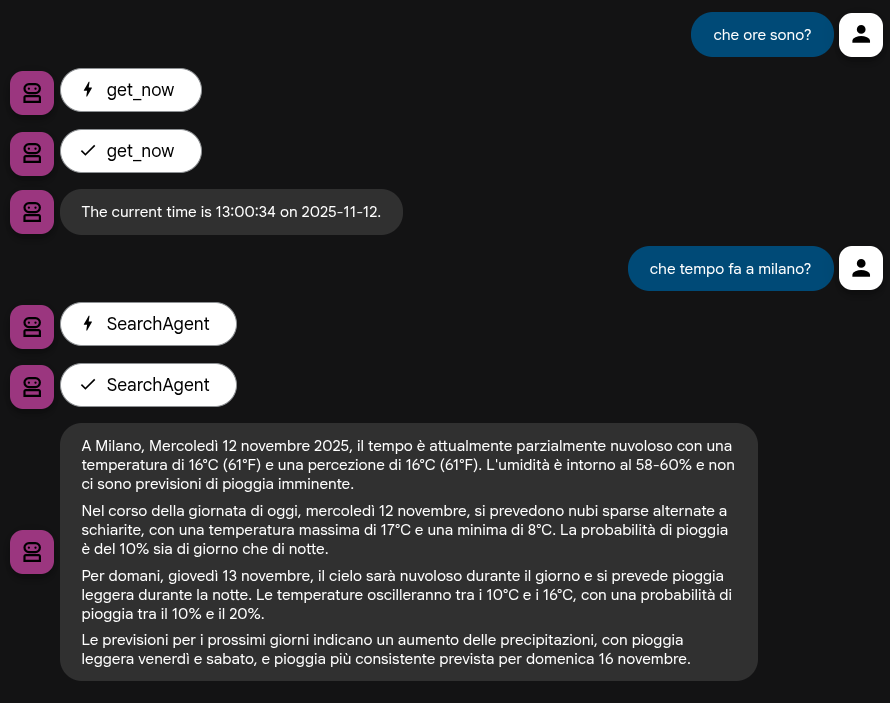

# Known Issues & Design Choices

This document lists known issues, limitations, and design decisions made during the development of this workshop.

## `gemini-2.5-flash` Limitation with Mixed Tool Types (Resolved via `AgentTool`)

**Issue:** The `gemini-2.5-flash` model, when used directly within a single `LlmAgent`, does not support making calls that mix different types of tools within the same turn. Specifically, it cannot handle a request that requires both a Grounding-based tool (like the built-in `google_search`) and a Function Calling-based tool (like our custom `get_now` function).

**Impact:** This limitation initially affected the natural progression of the workshop. The original plan for Step 3 was to *add* `google_search` to the existing `get_now` tool. Doing so resulted in a `400 Bad Request` error from the model API.

**Workaround (Implemented in `step03b_search_and_tool`):**

As per ADK documentation (and confirmed with `google-adk` version 1.18.0+), built-in tools like `google_search` can be used with other tools by wrapping them in an `AgentTool`.

1.  **Create a dedicated agent for the built-in tool:** An `LlmAgent` is created whose *only* tool is `google_search`.
2.  **Wrap this dedicated agent in an `AgentTool`:** This `AgentTool` instance is then added to the main agent's `tools` list.

This effectively isolates the `google_search` tool within its own agent context, allowing the main agent to use it alongside other function-calling tools (like `get_now`) without triggering the model's mixed-tool limitation.

**Workshop Progression:**

*   The main workshop track (`step03_search`) has been modified to *replace* the `get_now` tool with `google_search`. This ensures the primary workshop path is functional and demonstrates how to add a search tool simply.
*   A separate, optional step (`step03b_search_and_tool`) has been created. This step demonstrates the `AgentTool` workaround, allowing both `get_now` and `google_search` to work together using `gemini-2.5-flash`.

# Fix

Gemini CLI was able to fix the code.
* See code in 03b.. TODO(Gemini).
* See screenshot here:

